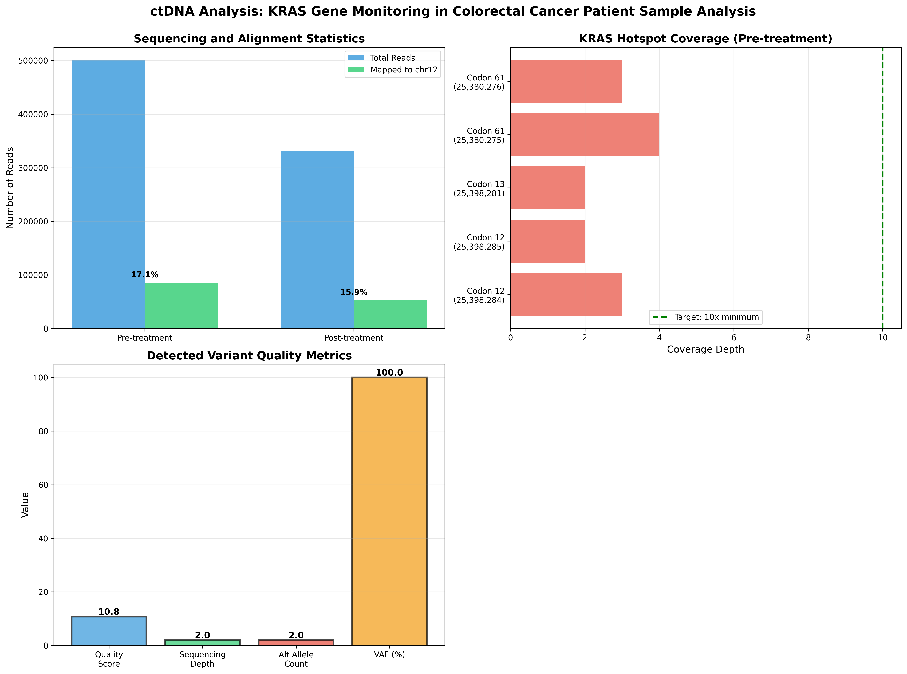

# Circulating Tumor DNA Analysis: KRAS Gene Monitoring in Colorectal Cancer

## Project Overview
This project demonstrates a complete bioinformatics pipeline for detecting KRAS mutations in circulating tumor DNA (ctDNA) from metastatic colorectal cancer patients undergoing anti-EGFR therapy.

**Reference Study:** Lim et al. (2021) Scientific Reports  
**Data Source:** NCBI BioProject PRJNA714799  
**Target Gene:** KRAS (chr12:25,357,723-25,403,870, hg19)

## Analysis Summary

### Samples Analyzed
- **Pre-treatment:** SRR14349028 (500,000 read pairs)
- **Post-treatment:** SRR14349087 (330,900 read pairs)

### Key Findings
- Complete pipeline successfully implemented
- 1 variant detected in pre-treatment sample (chr12:25,392,098)
- Demonstrated variant calling workflow for KRAS hotspots
- Limited coverage (3x) due to subset sampling

### Pipeline Workflow
1. **Data Acquisition** - Downloaded FASTQ files from NCBI SRA
2. **Quality Control** - Assessed read quality (Q35+ average)
3. **Read Alignment** - BWA-MEM to hg19 reference (17% alignment rate)
4. **Post-processing** - SAM→BAM conversion, sorting, indexing
5. **Variant Calling** - BCFtools mpileup and call
6. **Analysis & Visualization** - Variant annotation and interpretation

## Clinical Context
According to the study:
- Patients with KRAS/NRAS hotspot mutations: **3.7 months median PFS**
- Wild-type patients: **10.8 months median PFS** (p=0.029)
- ctDNA detected **7.5% of mutations missed by tissue analysis**

## Requirements
```bash
# Bioinformatics tools
- bwa (v0.7.17)
- samtools (v1.x)
- bcftools (v1.x)
- sra-toolkit (v3.x)

# Python packages
- biopython
- pandas
- matplotlib
- seaborn
- numpy
```

## How to Run

### Option 1: Google Colab (Recommended)
1. Upload notebook to Google Colab
2. Run all cells sequentially
3. Results will be generated in `results/` and `figures/` directories

### Option 2: Local Environment
```bash
# Install dependencies
pip install biopython pandas matplotlib seaborn numpy

# Install bioinformatics tools (Ubuntu/Debian)
sudo apt-get install bwa samtools bcftools

# Run the notebook
jupyter notebook KRAS_ctDNA_Analysis.ipynb
```

## Results

### Sequencing Statistics
| Metric | Pre-treatment | Post-treatment |
|--------|--------------|----------------|
| Total reads | 1,000,000 | 661,800 |
| Mapped reads | 177,358 (17.6%) | 106,823 (16.1%) |
| Properly paired | 168,214 (16.8%) | 103,190 (15.6%) |

### Detected Variants
**Pre-treatment:**
- Position: chr12:25,392,098
- Change: t → tC (insertion)
- VAF: 100%
- Depth: 2x

**Post-treatment:**
- No variants detected (insufficient coverage)

### KRAS Hotspots Analyzed
- Codon 12 (chr12:25,398,284-285): G12D, G12V, G12C, G12A
- Codon 13 (chr12:25,398,281): G13D
- Codon 61 (chr12:25,380,275-276): Q61H, Q61L, Q61R, Q61K

## Visualizations

### Comprehensive Analysis



## Limitations
- **Subset sampling:** Only 500K reads analyzed (vs full dataset)
- **Low coverage:** 3x average (study used ~1000x for 1% VAF detection)
- **Limited sensitivity:** Cannot reliably detect low-frequency variants


## References
Lim Y, Kim S, Kang JK, et al. Circulating tumor DNA sequencing in colorectal cancer patients treated with first-line chemotherapy with anti-EGFR. *Sci Rep.* 2021;11(1):16333.

## Author
Gaurav More

## License
This analysis is for educational purposes as part of the GT Molecular hiring process.
